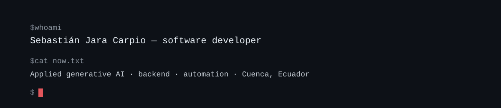

<picture>
  <source media="(prefers-color-scheme: dark)" srcset="assets/banner-dark-en.svg">
  <source media="(prefers-color-scheme: light)" srcset="assets/banner-light-en.svg">
  
</picture>

 

---

I’m in my last year of Software Engineering at the Universidad Católica de Cuenca, Ecuador. I spend most of my time building innovative projects to solve real problems, from backend development, automation, and generative AI implementation: agents, integrations, and processes that used to be done by hand.

I completed my internship in CEDIA’s Artificial Intelligence area and currently chair the IEEE CIS/CS chapter at UCACUE. My current aspirations and efforts point toward data engineering, machine learning, and applied research.

## Some things I’ve built

<table>
<tr>
<td width="50%" valign="top">

**Community management bot** · Luthier de Mundos  
`Python` `PostgreSQL` `Discord API`

Runs an international community of 2,000+ people, with 300 online at once. It manages interactions and generates votes for members, removing the need for external human administration.

</td>
<td width="50%" valign="top">

**WAIS test indices** · UDIPSAI  
`Spring Boot` `TypeScript` `PostgreSQL`

Computes cognitive scales that used to come from hand-crossing age-range tables. I was in charge of coordinating the development team, the architecture, and the database infrastructure.

</td>
</tr>

<tr>

<td width="50%" valign="top">

**AI automations**  
`n8n` `LLMs` `REST APIs`

Workflows that connect APIs and language models for clients and communities: from form to report, with nobody copy-pasting anything.

</td>

<td width="50%" valign="top">

**Availability calendar and more**  
`TypeScript` `Next.js` `PostgreSQL`

Projects that solve problems from my day-to-day life, such as an app that checks the schedules of several people and returns the hours that work for everyone, among others.

</td>
</tr>

</table>

## What I work with

**Languages**

**Frameworks**

**Data & infrastructure**

**AI & automation**

## Where I’ve been

|                             |                                                |             |
| --------------------------- | ---------------------------------------------- | ----------- |
| **CEDIA**                   | Intern, Artificial Intelligence area       | `2026`      |
| **Luthier de Mundos**       | Developer · international initiative       | `2025`      |
| **IEEE CIS/CS UCACUE**      | Joint chapter chair               | `2026–2027` |
| **Codary**                  | Founding member · UCACUE programming club | `2026`     |
| **Google Developer Groups** | Volunteer · 3+ national events             | `2024–Present`     |
| **Freelance**               | Full-stack systems and automation           | `2023–Present`     |

<b>Education & languages</b>

 

**B.Sc. Software Engineering** — Universidad Católica de Cuenca · graduating 2027

- Foundations of Generative Artificial Intelligence — CEDIA (40 h)
- Backend Programming and MCP in Python for Generative AI — CEDIA (40 h)

**Languages:** Spanish (native) · English C1 · Italian B1

## Metrics

<picture>
  <source media="(prefers-color-scheme: dark)" srcset="https://github-readme-stats.vercel.app/api?username=SebastianJara21&show_icons=true&include_all_commits=true&count_private=true&hide_border=true&title_color=C9D1D9&icon_color=8B949E&text_color=8B949E&bg_color=0D1117&custom_title=GitHub">
  
</picture>
<picture>
  <source media="(prefers-color-scheme: dark)" srcset="https://github-readme-stats.vercel.app/api/top-langs/?username=SebastianJara21&layout=compact&hide_border=true&title_color=C9D1D9&text_color=8B949E&bg_color=0D1117&custom_title=Languages">
  
</picture>

---

If any of this is useful or you want to build something together, reach out: [LinkedIn](https://www.linkedin.com/in/sebastian-jara-carpio/) · [sebasjarac@hotmail.com](mailto:sebasjarac@hotmail.com)
