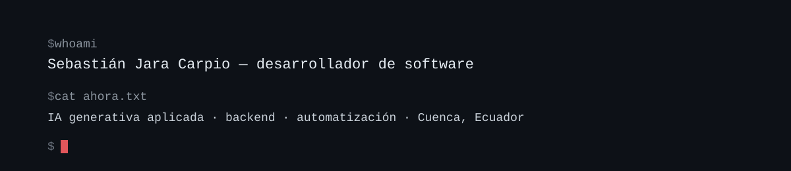

<picture>
  <source media="(prefers-color-scheme: dark)" srcset="assets/banner-dark.svg">
  <source media="(prefers-color-scheme: light)" srcset="assets/banner-light.svg">
  
</picture>

 

---

Actualmente cursando mi último año de Ingeniería en Software en Cuenca, Ecuador. Paso la mayor parte del tiempo desarrollando proyectos innovadores para solucionar problemas reales, desde backend, automatizacion e implementación de IA generativa: agentes, integraciones y procesos que antes se hacían a mano.

Terminé mis prácticas en el área de Inteligencia Artificial de CEDIA y presido el capítulo IEEE CIS/CS de la UCACUE. Mis aspiraciones y esfuerzos actuales apuntan al área de ingeniería de datos, machine learning e investigación aplicada.

## Algunas cosas que he construido

<table>
<tr>
<td width="50%" valign="top">

**Bot de gestión comunitaria** · Luthier de Mundos  
`Python` `PostgreSQL` `Discord API`

Organiza una comunidad internacional de +2000 personas, con +300 usuarios simultáneos. Gestiona interacciones y generea votaciones para los miembros, prescindiendo así de administración humana externa.

</td>
<td width="50%" valign="top">

**Índices del test WAIS** · UDIPSAI  
`Spring Boot` `TypeScript` `PostgreSQL`

Calcula escalas cognitivas que antes salían de cruzar tablas a mano por rangos de edad. Estuve a cargo de la coordinación del equipo de desarrollo, la arquitectura y infraestructura de base de datos.

</td>
</tr>

<tr>

<td width="50%" valign="top">

**Automatizaciones con IA**  
`n8n` `LLMs` `APIs REST`

Flujos que conectan APIs y modelos de lenguaje para clientes y comunidades: del formulario al reporte, sin que nadie copie y pegue nada.

</td>

<td width="50%" valign="top">

**Calendario de disponibilidad y más**  
`TypeScript` `Next.js` `PostgreSQL`

Proyectos que dan solución a problemas de mi día a día, como una app que cruza las agendas de varias personas y devuelve las horas que le sirven a todo el mundo, entre otras.

</td>
</tr>

</table>

## Con qué trabajo

**Lenguajes**

**Frameworks**

**Datos e infraestructura**

**IA y automatización**

## Dónde he estado

|                             |                                                |             |
| --------------------------- | ---------------------------------------------- | ----------- |
| **CEDIA**                   | Pasante, área de Inteligencia Artificial       | `2026`      |
| **Luthier de Mundos**       | Desarrollador · iniciativa internacional       | `2025`      |
| **IEEE CIS/CS UCACUE**      | Presidente del capítulo conjunto               | `2026–2027` |
| **Codary**                  | Miembro fundador · club de programación UCACUE | `2026`     |
| **Google Developer Groups** | Voluntario · +3 eventos nacionales             | `2024–Actualidad`     |
| **Freelance**               | Sistemas full-stack y automatización           | `2023–Actualidad`     |

<b>Formación e idiomas</b>

 

**Ingeniería en Software** — Universidad Católica de Cuenca · graduación 2027

- Fundamentos de Inteligencia Artificial Generativa — CEDIA (40 h)
- Programación de Backend y MCP en Python para IA Generativa — CEDIA (40 h)

**Idiomas:** español (nativo) · inglés C1 · italiano B1

## Métricas

---

Si algo de esto te sirve o quieres construir algo juntos, escríbeme: [LinkedIn](https://www.linkedin.com/in/sebastian-jara-carpio/) · [sebasjarac@hotmail.com](mailto:sebasjarac@hotmail.com)
